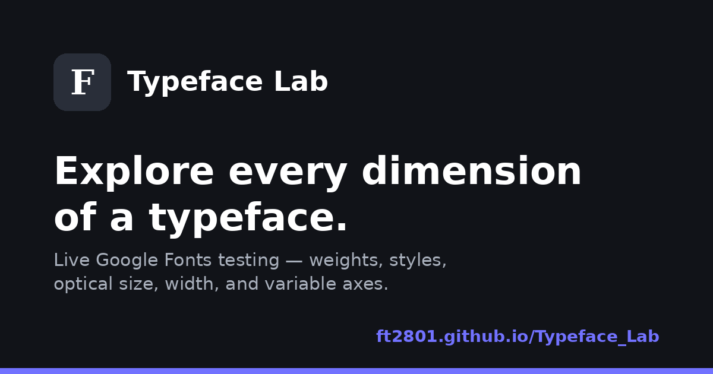

# Typeface Lab

[](https://ft2801.github.io/Typeface-Lab/)
[](LICENSE)
[](CHANGELOG.md)

Typeface Lab is a dependency-free typography workbench for exploring Google Fonts on a real interface. It combines a searchable catalog of 1,947 font families with controls generated from each family's published capabilities, including static weights, italic styles, and variable font axes.

**Live site:** [https://ft2801.github.io/Typeface-Lab/](https://ft2801.github.io/Typeface-Lab/)



## Purpose

Many font testers expose the same controls for every typeface, even when those controls do not map to features the font actually supports. Typeface Lab takes a capability-aware approach: it reads the selected family's embedded metadata and creates only the controls that are relevant to that family.

The project is intentionally delivered as a single static website. It requires no framework, package manager, compilation step, API key, or backend service.

## Features

- Searchable and alphabetically browsable catalog of 1,947 Google Fonts families.
- Lazy-loaded `Typeface` specimens for visible catalog entries.
- Capability-aware controls for static weights, italics, and variable axes.
- Support for standard and custom axes such as weight, width, optical size, slant, grade, roundness, softness, and more.
- Adjustable preview text, font size, line height, letter spacing, and alignment.
- Safe CSS2 URL generation using only variants and ranges published for the selected font.
- Font verification through the CSS Font Loading API before activation.
- Consistent Select Font controls for opening the responsive picker on desktop and mobile.
- Light and dark themes with locally persisted preference.
- Accessible keyboard navigation, dialogs, status announcements, and focus management.
- No runtime dependencies beyond the Google Fonts CSS and font delivery endpoints.

## How it works

1. Select Font opens the responsive font picker.
2. The embedded JSON catalog resolves a family name and supplies its category, variants, Latin support, and variable axes.
3. Typeface Lab builds a Google Fonts CSS2 request containing valid style combinations and axis ranges.
4. The browser loads and verifies the family through `document.fonts`.
5. The selected font is applied only after verification succeeds.
6. The workbench creates controls from the selected family's real capabilities.

Catalog specimens are loaded progressively as they approach the visible area. This avoids requesting every font when the catalog opens.

## Technology

- Semantic HTML5
- Modern CSS with responsive layouts and custom properties
- Vanilla JavaScript
- CSS Font Loading API
- Google Fonts CSS2 API
- Embedded Google Fonts metadata
- Web manifest and install icons

## Running locally

No installation is required.

```bash
git clone https://github.com/Ft2801/Typeface-Lab.git
cd Typeface-Lab
python3 -m http.server 8000
```

Open [http://localhost:8000](http://localhost:8000) in a browser.

Opening `index.html` directly also works in most browsers, but a local HTTP server more closely matches the GitHub Pages environment.

## Deploying to GitHub Pages

This repository is designed for branch-based GitHub Pages deployment and does not require a workflow file.

1. Push the repository to `https://github.com/Ft2801/Typeface-Lab`.
2. Open **Settings > Pages** in the repository.
3. Under **Build and deployment**, select **Deploy from a branch**.
4. Select the `main` branch and the `/ (root)` folder.
5. Save the configuration.

GitHub Pages will publish the site at:

```text
https://ft2801.github.io/Typeface-Lab/
```

The `.nojekyll` file prevents Jekyll processing and ensures the static files are served unchanged.

## Project structure

```text
.
├── .github/
│   ├── ISSUE_TEMPLATE/
│   ├── CODEOWNERS
│   └── pull_request_template.md
├── .well-known/
│   └── security.txt
├── assets/
│   ├── apple-touch-icon.png
│   ├── favicon-16x16.png
│   ├── favicon-32x32.png
│   ├── icon-192.png
│   ├── icon-512.png
│   ├── maskable-icon-512.png
│   └── social-preview.png
├── .editorconfig
├── .gitattributes
├── .gitignore
├── .nojekyll
├── 404.html
├── browserconfig.xml
├── CHANGELOG.md
├── CODE_OF_CONDUCT.md
├── CONTRIBUTING.md
├── favicon.ico
├── favicon.svg
├── humans.txt
├── index.html
├── LICENSE
├── README.md
├── robots.txt
├── SECURITY.md
├── sitemap.xml
└── site.webmanifest
```

## Network and privacy notes

Typeface Lab does not include analytics, advertising, cookies, or a backend. Theme preference is stored locally in the browser. Font stylesheets and files are requested from `fonts.googleapis.com` and `fonts.gstatic.com` when previews or selected families are loaded; those requests are subject to Google's own policies.

## Browser support

The website supports current Chrome, Edge, Firefox, and Safari browsers. It relies on modern browser features including `FontFaceSet`, `IntersectionObserver`, CSS custom properties, and the native `<dialog>` element.

## Contributing

Issues and pull requests are welcome. Read [CONTRIBUTING.md](CONTRIBUTING.md) before proposing a change. Security-related reports should follow [SECURITY.md](SECURITY.md).

## License

The Typeface Lab source code is available under the [MIT License](LICENSE).

Copyright (c) 2026 [Fabio Tempera](https://github.com/Ft2801).
